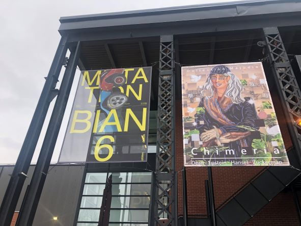
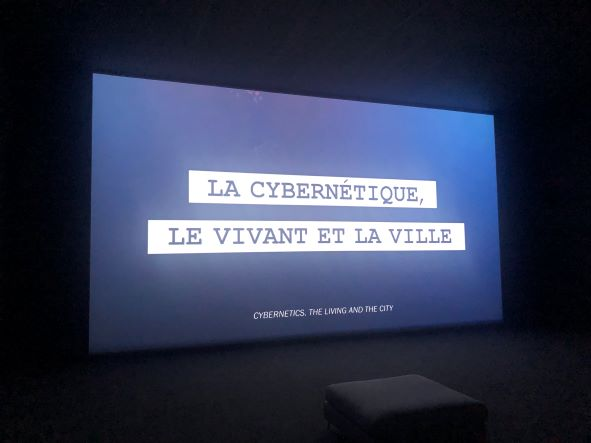
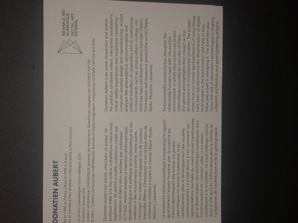
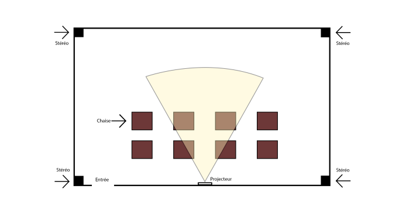
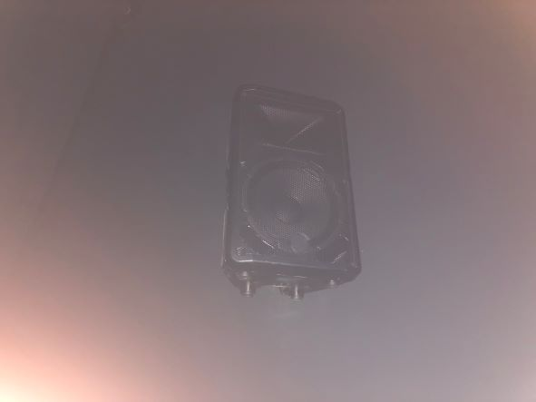
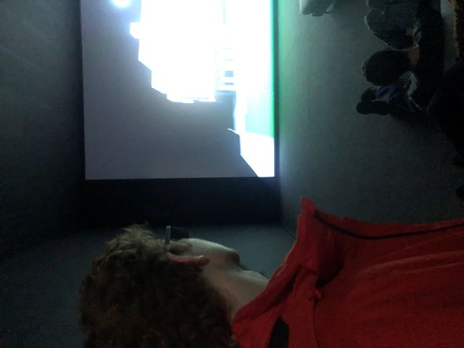

# LA 6e BIENNALE INTERNATIONALE D'ART NUMÉRIQUE (BIAN)

# Lieux
**Arsenal, 2020 Rue William, Montréal, QC H3J 1R8**

# Type d’exposition
**Exposition intérieur et temporaire**

# Date de la visite
**2 Février 2023**

# Nom de l’oeuvre
**Les Jardins Cybernétiques**

# Artiste:
**Donatien Aubert**

# Année de réalisation:
**2020**

# Description de loeuvre:

Le court-métrage montre le rôle qu’a eu l’informatique dans la refonte de l’urbanisme, de l’architecture ou encore dans la mise à l'étude de projets de géo ingénierie. Il montre aussi que si les technologies numériques nous permettent de mieux organiser nos habitats grâce à des batteries d’indicateurs climatiques, voire même de répliquer artificiellement des services écologiques rendus par le vivant (grâce à l’ingénierie biomimétique), elles nous contraignent réciproquement à accroître la part qu’elles occupent dans notre capacité à agir sur le monde (selon une trajectoire où celui-ci est soumis à une fonctionnalisation accrue). Le court-métrage dresse le bilan de cette histoire et quelles peuvent être ses perspectives de développement.

Source: https://www.donatienaubert.com/les-jardins-cybern%c3%a9tiques-(court-m%c3%a9trage).html

# Type installation
**Immersif(stéréo) et Contemplative(projection)**

# Faire un croquis de la mise en espace
**L’œuvre a une pièce a elle seul; elle contient 1 stéréo dans chaque coin de la pièce ainsi qu’un projecteur qui projette sur le mur blanc opposé au projecteur. De plus il y a plusieurs chaise dans le milleu de la pièce pour ceux qui préfére être assis.**

# Composantes techniques:
**1 projecteur, 4 Stéréo**

# Mise en exposition:
**Pour la mise en exposition le musée a seulement besoin d'une pièce spacieuse avec 4 stéréo, 1 projecteur et 1 mur blanc**

# Expérience vécue

 **Les visiteur sont attendus a soit s'asseoir dans la salle ou rester debout et regarder la présentation projeter en silence afin de ne pas gâcher l'immersion des autres visiteurs. J’aime la façon dont ils ont installé disposer de la présentation. En effet, l'installation de stéréo a chaque coins de la pièce nous donne l'impression d'être dans la vidéo. De plus, la présentation est projeté sur un grand mur blanc ce qui rend le tout encore plus immersive. Bref, sur toutes les œuvres présentés, celle-ci est facilement ma préféré, par sa disposition et l'immersion hors du commun qu'elle me procure.**
  
  
  

 
 # Ce qui m'a plu:
Comme j'ai précisé plus tôt, j'ai adorer immersion hors du commun qu'offre cette œuvre grâce aux stéréos et la projection grand écran. Cette présentation m'inspire beaucoup a faire le même style d'immersion chez moi; faire une salle avec un projecteur et stéréo dans chaque coins afin de pouvoir créer des présentations immersives aux confort de ma maison. 

# Aspect que je n'ai pas aimer et que je ne vais pas retenir:
Même si la manière que la présentation était présenté était extraordinaire, je n'aimais pas nécessairement tous les éléments de la vidéo présentés. Je pense qu'une salle comme celle-ci pourrais avoir beaucoup plus de potentiel avec des présentations 3d ou 4k et/ou des présentations avec immersions sonores qui utilisent la combinaison des stéréos a leur pleins potentiels. En effet, avoir 4 stéréo dans une pièce spacieuse peut donner un potentiel extraordinaire pour des films ou présentation immersive et ce n'était pas vraiment le cas dans celle-ci. Oui la présentation était immersive, mais elle aurait pu être encore plus immersive.

# Références

Source: https://www.donatienaubert.com/les-jardins-cybern%c3%a9tiques-(court-m%c3%a9trage).html (site internet auteur)

Source: https://images-na.ssl-images-amazon.com/images/I/71UfWjg8stL._AC_SL1500_.jpg (stéréo)

Source: https://th.bing.com/th/id/OIP.Fwg__VaDr9A5WB3nyDksAAHaC5?pid=ImgDet&rs=1 (projecteur)

