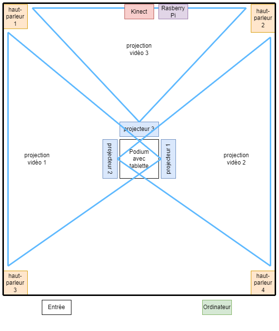
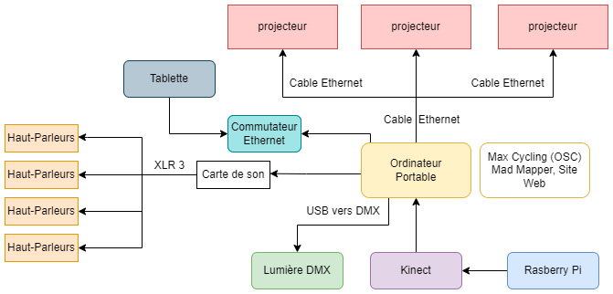
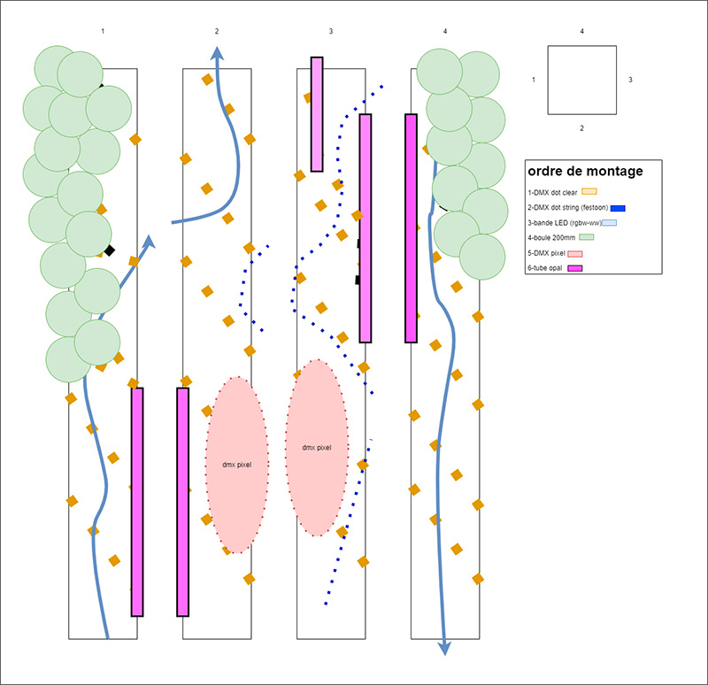
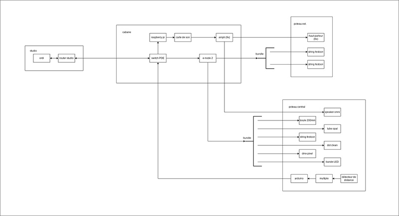
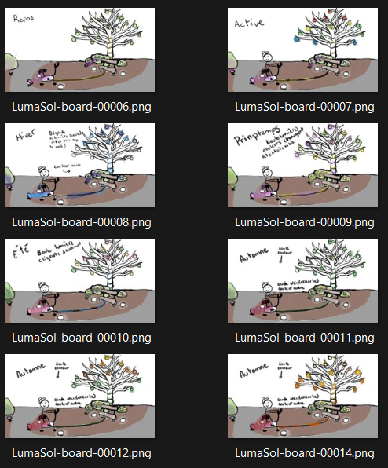
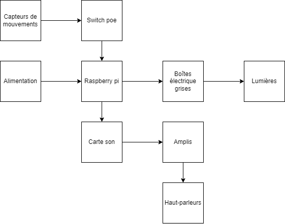
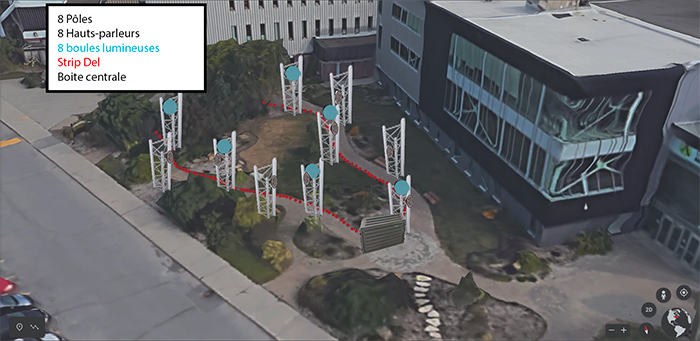

# ECHOMARINE
Créer par: 
* Florence Lapierre
* Natacha Abdallah
* Tracy Gua et Maria 
* Laura Coronel

Schéma1:

Schéma2:

Lien:https://tim-montmorency.com/2023/projets/Echomarine/docs/web/index.html

<h3> 3 cours essentiels selon moi:</h3>
 
 Cours d'audio
 Cours de web/programmation
 Cours d'animation 2D

<h3>Application que je ne connaissais pas: </h3>
Reaper; c'est l'application d'audio utilisé dans ce projet.

# EDRIA
Créer par: 
  * Elwin Durand
  * Loic Delorme
  * Dominic Roberts
  * Gabriel Leblanc
  * Meryem Berbiche
  * Jean-Christophe

Lien: https://tim-montmorency.com/2023/projets/EDRIA/docs/web/index.html

Schéma1:

Schéma2:

<h3> 3 cours essentiels selon moi:</h3>
 
 Cours de conception audio
 Cours d'installation multimédia
 Conception d’une expérience multimédia

<h3>Application que je ne connaissais pas: </h3>
VCV RACK 2: Créer des sons spéciaux

# LumaSol
Créer par: 
  * Éloïse Gagné
  * Skayla Stimphil
  * Michaël Simard
  * Pénélope Morrisson

Lien: https://tim-montmorency.com/2023/projets/LumaSol/docs/web/index.html

Schéma1:

Schéma2:

<h3> 3 cours essentiels selon moi:</h3>
 
 Cours de Domaines multimédias
 Cours d'installation multimédia
 Conception d’une expérience multimédia

<h3>Application que je ne connaissais pas: </h3>
Mad Mapper: Pour contrôler le son et la lumière.

# Nexum
Créer par: 
  * Sébastien Reilly
  * Sabrina Laforest
  * Alexandre Daniel
  * Maxime Des Lauriers

Lien: https://tim-montmorency.com/2023/projets/Nexum/docs/web/index.html

Schéma1:

Schéma2:

<h3> 3 cours essentiels selon moi:</h3>
 
 Cours de conception audio
 Cours d'installation multimédia
 Conception d’une expérience multimédia

<h3>Application que je ne connaissais pas: </h3>
 Qlc+: Pour contrôler la lumière.
