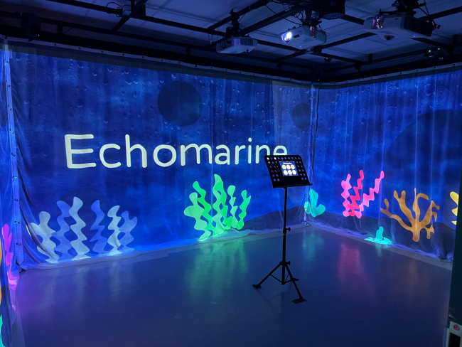

# Ma préférence:
   
# ECHOMARINE
 
 Créer par: 
* Florence Lapierre
* Natacha Abdallah
* Tracy Gua et Maria 
* Laura Coronel

# Année de réalisation
   2023
   
# Description de l'œuvre
En cliquant sur un animal sous-marin depuis un écran tactile, nous allons avoir une définition documentaire de cet animal. De plus, lorsque sélectionné l'animal va apparaitre dans l'eau via projecteur et vas se promener dans les fonds marins.

# Date de la visite
23/03/2023

# Adresse d'exposition
475 Boulevard de l'avenir, Laval, QC H7N-5H9

# Type d'installation
Intérieur, temporaire et contemplatif

# Mise en espace

L'œuvre prend tout l'espace du petit studio. En effet, des projecteurs positionnés au plafond projettent la scène sur 3 des 4 murs du studio afin d'avoir une immersion intense. Aussi au meilleur de la pièce se trouve un lutrin avec une tablette sur laquelle on peut commencer l'immersion.

# Composantes et techniques
   
   Projecteurs, tablette et haut-parleurs
   
# Éléments nécessaires à la mise en exposition
   
   Projecteurs, tablette, haut-parleurs, grande salle et peut-être un ordinateur.
   
# Expérience vécue
   
  En tant que visiteurs nous devant nous approcher de la tablette et sélectionner un animal, celui-ci apparaitra sur les projecteurs et un documentaire sur cet animal sera lancée.
  
# Ce qui m'a plu
  J'adore leur concept sous-marin immersif, on a vraiment la sensation d'être au fond de la mer parmi les animaux marins les plus majestueux. Leurs projets étaient complètement différents de tous les autres et j'ai adoré la façon dont ils ont présenté leur "documentaire" des fonds marins.
  
# Aspect que je souhaiterais retenir pour mes propres créations

Le style des animations ainsi que le positionnement des haut-parleurs afin de créer un son ambiant immersif.

# Aspect que je ne souhaiterais pas retenir pour mes propres créations ou que je ferais autrement
 
 Je pense qu'il aurait fallu avoir un peu plus d'effets sonores pour les animaux marins. 
 
 
 Source: [Echomarine](https://tim-montmorency.com/2023/projets/Echomarine/docs/web/index.html)
