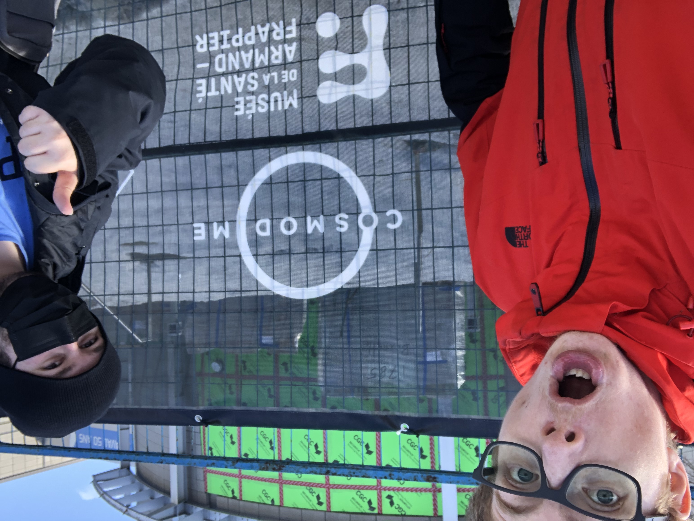
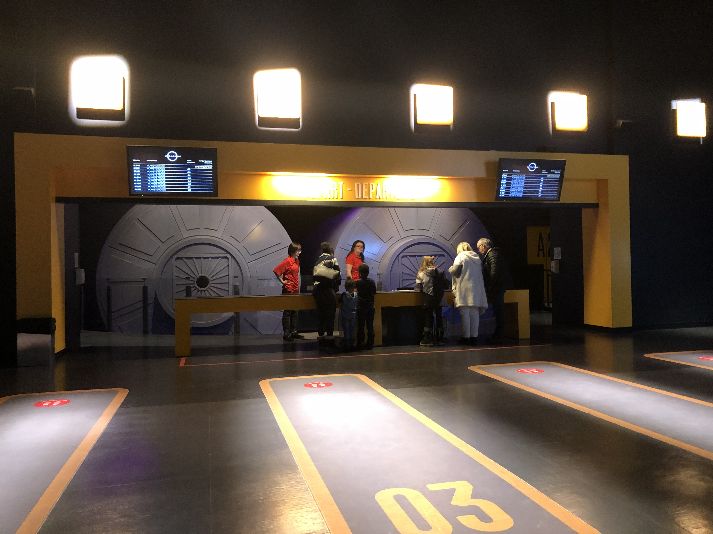

Mission Virtuel du cosmos
 

 
Source: [Cosmodome](https://www.google.com/url?sa=i&url=https%3A%2F%2Fcosmodome.org%2Fen%2Ffamily-activities%2Fvirtual-missions%2F&psig=AOvVaw0vRFJoG-hRLqvv1h4t3bRW&ust=1683128298345000&source=images&cd=vfe&ved=0CBEQjRxqFwoTCPiVwdT71v4CFQAAAAAdAAAAABAT)

Cosmodome
2150 A. des Laurentides, Laval, QC H7T 2T8

Type d'exposition: Intérieur Permanent

Date de la visite
19 Mars 2023

Nom de l'oeuvre Mission Virtuel du cosmos

Artiste: Unknown

Année de réalisation: Unknown

Description de l'oeuvre:
      La mission virtuel commence par l'utilisation d'une tablette pour choisir un écusson d'équipe et créer un nom.
      Ensuite, nous avons regardé une vidéo explicative de mise en contexte, afin de bien pouvoir comprendre les étapes/activités a venir.
      Ensuite nous avons écouter une vidéo qui raconte l'histoire de notre système solaire et qu'elles aspect particuliers ils ont.
      Ensuite, nous devions choisir quelle planête du système solaire nous voulions explorer par sonde.
      Par la suite, dépendament de l'option choisir, une courte vidéo descriptive nous décrit les enjeux de cette planète et les dangers d'y envoyer une        sonde.
      Ensuite, nous devions nous créer une fusée relativement aux enjeux et problématiques qui sont requises pour le voyage. 
      Nous devions aussi choisir qu'elle sonde serait préférable ainsi que choisir les accessoires approprié pour la mission.
      Par la suite, une activité interractive se présentais a nous; une table intéractive en plein millieux de la salle et des écrans munis chacun d'un bouton en dessus. Nous devions trouver sur les écrans muraux l'image qui nous est affiché sur la table.
      Apres c finis.
      
      
  
Type d'installation: Immersive et Interractive

