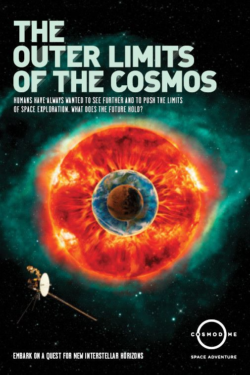
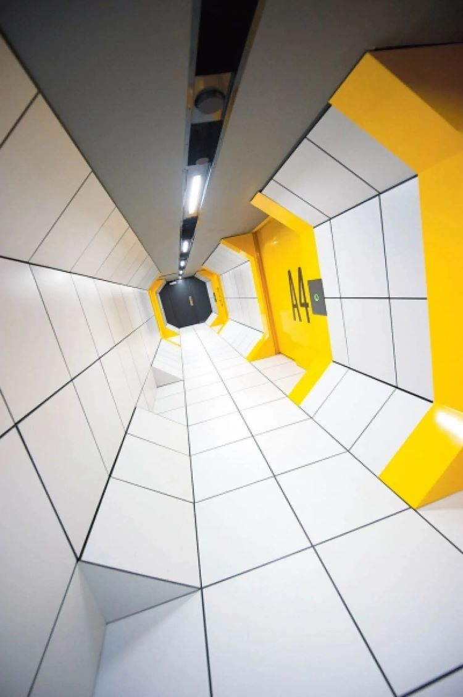
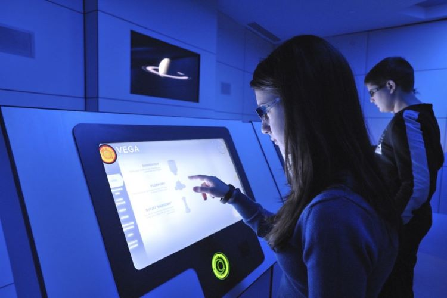
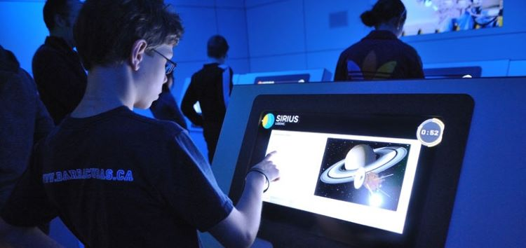

Mission Virtuel du cosmos
 

 
Source: [Cosmodome](https://www.google.com/url?sa=i&url=https%3A%2F%2Fcosmodome.org%2Fen%2Ffamily-activities%2Fvirtual-missions%2F&psig=AOvVaw0vRFJoG-hRLqvv1h4t3bRW&ust=1683128298345000&source=images&cd=vfe&ved=0CBEQjRxqFwoTCPiVwdT71v4CFQAAAAAdAAAAABAT)

Cosmodome
2150 A. des Laurentides, Laval, QC H7T 2T8

Type d'exposition: Intérieur Permanent

Date de la visite: 
19 Mars 2023

Nom de l'oeuvre: Mission Virtuel du cosmos

Artiste: Unknown

Année de réalisation: Unknown

Description de l'oeuvre:
 
La mission virtuel commence par l'utilisation d'une tablette interractive, afin de choisir un écusson d'équipe et créer un nom.
Ensuite, nous devons regardé une vidéo explicative de mise en contexte, afin de bien pouvoir comprendre les étapes/activités a venir.
Par la suite, il faut écouter une vidéo qui raconte l'histoire de notre système solaire et qu'elles aspect particuliers ils ont.
Apres la vidéo, il est demandé de choisir quelle planête du système solaire nous voulons explorer par sonde.
Ensuite, dépendament de l'option choisi, une courte vidéo descriptive nous décrit les enjeux de cette planète et les dangers d'y envoyer une sonde.
Grâce a la vidéo, nous devons créer une fusée relative aux enjeux et problématiques qui sont requises pour le voyage. 
Nous devons aussi choisir qu'elle sonde serait préférable ainsi que choisir les accessoires approprié pour la mission.
Par la suite, une activité interractive se présente a nous; une table intéractive en plein millieux de la salle et des écrans munis chacun d'un bouton en dessus. Enfin, nous devons trouver sur les écrans muraux l'image qui nous est affiché sur la table.

 
Source1: [LeDevoir](https://user-images.githubusercontent.com/106936139/235718921-1fc05fd3-ac3e-43d5-8028-5f2a53a03592.png)
Source2: [LeDevoir](https://www.ledevoir.com/societe/science/338495/vers-l-infini-et-plus-loin-encore-le-nouvel-espace-du-cosmodome)

 
 Source1: [LaPresse](https://www.google.com/url?sa=i&url=https%3A%2F%2Fwww.lapresse.ca%2Fvoyage%2F201112%2F28%2F01-4481425-le-cosmodome-redecolle-en-mode-virtuel.php&psig=AOvVaw1Mo1RCA5Ie2agiWQuzfjFa&ust=1683129654409000&source=images&cd=vfe&ved=0CBEQjRxqFwoTCJiRi9uA1_4CFQAAAAAdAAAAABAO)
      
  
Type d'installation: Immersive et Interractive

 
Source: [Portail_Immersion](https://www.google.com/url?sa=i&url=https%3A%2F%2Fportailimmersion.ca%2Fitem%2Faux-frontieres-du-cosmos%2F&psig=AOvVaw1Mo1RCA5Ie2agiWQuzfjFa&ust=1683129654409000&source=images&cd=vfe&ved=0CBEQjRxqFwoTCJiRi9uA1_4CFQAAAAAdAAAAABAW)

Fonction du dispositif multimédia:
 
      Cette oeuvre sert a nous informer sur l'espace et sur son histoire. Ils mettent en valeur l'effort aérospatial et nous encouragent a apprendre plus sur le sujet.
      
      
Mise en espace:
 
      La disposition de l'oeuvre est présenté sur plusieurs place complétement différentes.
      Entre-autres, des tunnels(comme au dessus), des salles avec éran interractives qui nous font interragir avec des scénarios(comme au-dessus), ainsi que des écran style cinéma qui nous expliquent l'histoire de l'espace(comme en dessous).

 
Source: [Tourisme_Laval](https://www.google.com/url?sa=i&url=https%3A%2F%2Fwww.tourismelaval.com%2Fexplorer-possibilites%2Fattraits%2Fcosmodome&psig=AOvVaw1Mo1RCA5Ie2agiWQuzfjFa&ust=1683129654409000&source=images&cd=vfe&ved=0CBEQjRxqFwoTCJiRi9uA1_4CFQAAAAAdAAAAABAb)

Composants et tehcniques:
 
      Ils ont utilisé plusieurs projecteur pour faire l'effet d'écran large dans la salle d'histoire.
      Ils ont utilisé plusieur écrant tactile dans les autres salles a usage différent, dépendament des activités
      
      
Élément nécessaires à la mise en exposition
 
      Le cosmodome a surment fournis les projecteurs, sièges, salles et branchement.
      
      
Expérience Vécue 
 
      L'interacteur doit premierement se diriger vers un premier écrant tactile et se créer un nom, choisir un écusson et choisir si il veut travailler en équipe avec quelqu'un d'autre. Ensuite il se dirige vers la premiere salle, ou il doit s'asseoir et écouter le documentaire présenté a l'écran. Par la suite, il doit se présenter a la prochaine salle ou il doit choisir grace un écran tactile, qu'elle planète parmis le systeme solaire il voudrait voyager. Par la suite, il doit se diriger vers une autre salle où encore sur un écran tactile, il vas contruire sa propre fusée ainsi que son équipement. Ensuite, il se dirige dans une autre salle documentaire ou il doit écouter ses prochaines directives ainsi que quelques lecons d'histoires. Enfin, il doit se diriger a la derniere salle ou se trouve un écran tactile géant où chaque voyageur doit accomplir des taches différentes.
      
      
Ce qui m'a plu
 
      J'ai adorer l'étape de construire sa fusée en fonction de l'environnement dans laquelle nous allons être projeté, nous devions choisir quelle pièce et équipement prendre ainsi que calculer la trajectoire de lancement. Aussi j'ai aimer la derniere étape où l'on devait accomplir plusieurs tâches dans un certains nombre de temps donner.
      
      
Aspect que je ferais autrement
 
      Je trouve que c'était vraiment trop vite et qu'ils auraient du faire un plus grand focus sur les activités interractives plutôt que sur les vidéos presque inutile. En général j'ai été un peu dessus et je m'attendais a beaucoup plus.
      
      
Référence

 Source1: [LeDevoir](https://user-images.githubusercontent.com/106936139/235718921-1fc05fd3-ac3e-43d5-8028-5f2a53a03592.png)
  
 Source2: [LeDevoir](https://www.ledevoir.com/societe/science/338495/vers-l-infini-et-plus-loin-encore-le-nouvel-espace-du-cosmodome)
  
 Source3: [Portail_Immersion](https://www.google.com/url?sa=i&url=https%3A%2F%2Fportailimmersion.ca%2Fitem%2Faux-frontieres-du-cosmos%2F&psig=AOvVaw1Mo1RCA5Ie2agiWQuzfjFa&ust=1683129654409000&source=images&cd=vfe&ved=0CBEQjRxqFwoTCJiRi9uA1_4CFQAAAAAdAAAAABAW)
  
Source4: [Tourisme_Laval](https://www.google.com/url?sa=i&url=https%3A%2F%2Fwww.tourismelaval.com%2Fexplorer-possibilites%2Fattraits%2Fcosmodome&psig=AOvVaw1Mo1RCA5Ie2agiWQuzfjFa&ust=1683129654409000&source=images&cd=vfe&ved=0CBEQjRxqFwoTCJiRi9uA1_4CFQAAAAAdAAAAABAb)
 
Source5: [LaPresse](https://www.google.com/url?sa=i&url=https%3A%2F%2Fwww.lapresse.ca%2Fvoyage%2F201112%2F28%2F01-4481425-le-cosmodome-redecolle-en-mode-virtuel.php&psig=AOvVaw1Mo1RCA5Ie2agiWQuzfjFa&ust=1683129654409000&source=images&cd=vfe&ved=0CBEQjRxqFwoTCJiRi9uA1_4CFQAAAAAdAAAAABAO)
